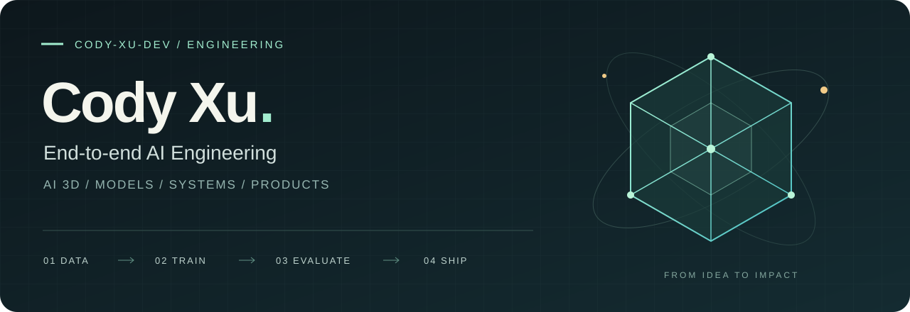

  

  <strong>徐士程 · Cody Xu</strong> 
  软件开发高级工程师 · AI 3D 方向 
  从数据与模型，到可靠的系统与可用的产品。

  <a href="#about">技术定位</a> &nbsp; / &nbsp;
  <a href="#work">项目实践</a> &nbsp; / &nbsp;
  <a href="#toolbox">技术栈</a> &nbsp; / &nbsp;
  <a href="#milestones">经历与荣誉</a>

---

### 01 / 技术方向与定位 · Technical Focus

目前在 **群核科技** 从事 AI 3D 方向研发。

- **三维生成与材质理解**（3D Generation & Material Understanding）
- **三维几何处理与行业适配**（3D Geometry Processing & Industry Adaptation）
- **三维数据工程与质量治理**（3D Data Engineering & Quality）
- **模型训练与效果对齐**（Model Training & Alignment）
- **分布式推理与系统优化**（Distributed Inference & Systems Optimization）
- **模型评测与行业应用**（Model Evaluation & Industry Applications）

长期围绕**三维数据、生成模型、几何算法与工程系统的协同**，推进从数据构建、模型优化到几何处理、推理服务和产品应用的完整链路，关注生成质量、运行效率与真实业务中的稳定交付。

*Connecting 3D data, generative models, geometry algorithms, and production systems — from experimentation to reliable deployment.*

### 02 / 项目实践

**Lux3D · 分布式推理与产品化**  
负责分布式推理服务的架构设计与核心开发，覆盖模型常驻、任务并行、分阶段流水线、版本治理与监控；参与网站前后端初期建设及 OpenAPI 接入，让模型能力进入实际业务流程。

[访问 Lux3D / Live Website ↗](https://lux3d.aholo3d.cn/lux3d/home) · [Lux3D Skill ↗](https://labs.aholo3d.cn/api-docs/skills/lux3d)

**材质翻译 · 从数据构造到后训练**  
围绕不同渲染器材质到 PBR 表达的转换，推进数据生产、固定测试集、SFT 与 RL 后训练，结合渲染反馈和可视化评测持续改进模型效果。

**AI 3D 数据工程 · 可持续的训练数据供给**  
建设三维素材分类打标、质量清洗、去重、类别均衡与版本化交付流程；参与 GaussMesh 数据生产及 DiT 训练实验，打通数据准备、训练和验证。

**模型评测 · 让效果可以比较**  
建设自动评测、可视化报告与主观盲评工具，将模型对比和版本选择沉淀为可追踪的评测过程。

以上为工作经历摘要；相关项目不代表个人开源仓库。

### 03 / 技术栈 · Tech Stack

| 类别 | 技术 |
| :--- | :--- |
| 编程语言 | Python · Java · C / C++ · Verilog |
| AI 框架 | PyTorch · MindSpore |
| 模型架构 | Transformer · DiT · VAE |
| 模型训练 | SFT · RL |
| 后端与推理 | Java · Spring Boot · FastAPI · OpenAPI · 分布式推理 |
| 三维表征 | Mesh · 3DGS · Voxel · NeRF · SDF |
| 三维处理 | 网格处理 · PBR 材质 · 多视角渲染 |
| 边缘部署 | 华为昇腾 · 瑞芯微 · 树莓派 · ROS |

### 04 / 经历与荣誉

- **2025 — 至今** · 群核科技 / 软件开发高级工程师（AI 3D 方向）
- **2023 — 2024** · 杭州旷维矩锐科技有限公司 / AI 算法工程师实习 · AIoT、端云协同与边缘模型部署
- **2021 — 2025** · 杭州电子科技大学 / 电子信息工程本科

#### 工作荣誉 / Professional Honors

| 年份 | 荣誉 |
| :--- | :--- |
| 2025 | H2 绩效 A（1/10） |
| 2025 | 第十四届 Hackday 技术创新大赛 · 对外赛道一等奖 |
| 2025 | 第十四届 Hackday 技术创新大赛 · 最具人气王奖 |
| 2025 | H2 最佳 X 工程师 |
| 2026 | H1 绩效 A（1/14） |
| 2026 | 第十五届 Hackday 技术创新大赛 · 最具人气王奖 |
| 2026 | 第十五届 Hackday 技术创新大赛 · 最佳场景和商业潜力奖 |
| 2026 | H1 小蓝书主人公“勇于创新，积极推动变革”提名 |

#### 校园荣誉 / Academic Honors

| 级别 | 荣誉 |
| :--- | :--- |
| 国家级 | 中国国际大学生创新大赛（2024）金奖 |
| 国家级 | 中国国际大学生创新大赛（2023）铜奖 |
| 国家级 | 2024 大学生创新创业训练计划 · 立项一项 |
| 国家级 | 第八届创客中国大数据中小企业创新创业大赛 · 二等奖 |
| 省部级 | 浙江省国际互联网+大学生创新创业大赛 · 金奖 |
| 省部级 | 华为昇腾 AI 创新大赛 2023 应用赛道 · 二等奖 |
| 省部级 | 华为昇腾 AI 创新大赛 2023 开发者套件赛道 · 二等奖 |
| 省部级 | 2023 浙江省科技创新活动计划 · 结项一项 |
| 省部级 | 第十九届浙江省大学生电子商务竞赛 · 一等奖 |
| 省部级 | 浙江省政府奖学金 · 一项 |
| 市级 | 杭州市人工智能学会 · 会员 |
| 市级 | 第九届杭州市大学生科技创新大赛 · 二等奖 |
| 企业级 | 华为昇腾 Ascend Compatible 认证证书 · 一项 |
| 企业级 | 华为昇腾 AI 金种子实训班 · 结业证书 |
| 企业级 | 阿里云 & Datawhale · AI Agent 工程师认证 |
| 企业级 | 科大讯飞 & Datawhale · AI Prompt 工程师认证 |
| 校级 | 校优秀学生一等奖学金 · 一项；二等奖学金 · 两项 |
| 校级 | 校创新创业奖学金 · 一项 |

---

  代码之外，也喜欢音乐，曾担任乐队鼓手。  
  <strong>IDEAS → MODELS → SYSTEMS → PRODUCTS</strong>

